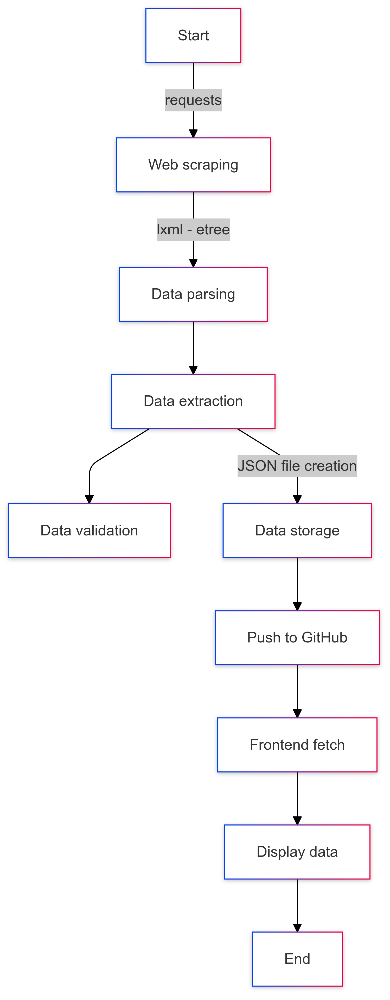

# staff-email-finder
## A free website for finding MSS staff email

## 💡Intro
This website is **static** and hosted by **[GitHub Pages](https://singangle.github.io/staff-email-finder/)**. The purpose of this website is to offer students at Meridian Secondary School an interactable website to find their teacher's email addresses. It has two parts, frontend (HTML, CSS, and Javascript) and backend (python). While the frontend displays all the content of this site, the backend scraps data from the school's webpage automatically. 



## 💡Backend with Python
The backend uses these Python libraries: git, json, lxml, requests, re, and time.

### 1.Requesting and Parsing Data:

First, all four of the school's URLs are requested using `requests.get` with `header` from Microsoft Edge to avoid `418 I'm a teapot` error. Second, `etree` from `lxml` is used to parse the HTML into strings. Since the names, designations, and email addresses of teachers are in different depths of the DOM, two separate etree expressions are used, for example:
```
middle_managers = etree.HTML(response2.content).xpath('//*[@id="main-content"]/section[3]//tr/td/p/text()')
middle_managers_email = etree.HTML(response2.content).xpath('//*[@id="main-content"]/section[3]//tr/td/p/a/text()')
```
After that, `for loop` is used to arrange information in this format `{'name': ['designation', 'email address']}`. The four dictionaries generated from the four URLs will then be combined into one. The code then loops through all the email addresses, checking their legitimacy with `regular expression`. For the invalid ones, they will be replaced by an **empty string**.

### 2. Saving data:

Now the data is ready to be wrapped up and sent to the server. The `json` library gives me the functionality to write this combined dictionary into `all_teachers_info.json` using `json.dump()`. `indent` is set to **4** for aesthetic purposes. The `time` library is also used to generate a **timestamp** of the last update:

```
current_time_struct = time.localtime()
formatted_time = time.strftime('%Y/%m/%d/%H:%M', current_time_struct)
```

### 3. Automating Updates with Git:

It too will be written into a JSON file called `timestamp.json`.

After all these are done, the two JSON files are passed to the server with `GitPython` using `repo.index.add` and `repo.index.commit`. As the website is hosted with **GitHub Pages**, pushing the files to GitHub submits the changes to the server *automatically*. With the help of **Task Scheduler**, a `.bat` file will be executed *daily* at 17:40 when connected to the Internet.
```
"C:\Users\hh415\AppData\Local\Programs\Python\Python312\python.exe" "C:\Users\...my personal directory...\json_finder.py"
pause
```
This `.bat` file simply runs the Python program. Hence, it updates the name list *daily*.

## 💡Frontend with HTML, CSS and JavaScript

### 1. HTML
There are **four** `HTML` files in this project, each representing a page of the website. They are:
- `index.html` -- the **homepage** of this project. It is also the place where users search for their teacher's email address.
- `declaration.html` -- Where **disclaimer** and **acknowledgment** are.
- `contact_author.html` -- Shows the **author's email address** and a link to Google form (suggestions to this website)
- `Other Information` -- **Implementation details**

> [!NOTE]
> `<a> tags` are used at the bottom of each page, allowing users to **switch** between pages ***conveniently***. For example: 
> ``` <div class="tab-div"><a href='index.html' class="display-sm-12px">Homepage</a> ```

In `index.html`, there is a `<header>` tag, which shows the title of the website:
> What's their email?

An `<h4>` tag is also used to show the subtitle of the website:
> Free Website for Finding MSS Staff Email

Besides these, there is an `` tag nested in an `<a>` tag. It shows the **logo of MSS**. When clicked, it will redirect the user to **[MSS's webpage for all emails (not interactive)](https://www.meridiansec.moe.edu.sg/about-us/our-organization/our-school-leaders/)**

To select the title of teachers, a **dropdown menu** is chosen. A `<form>` tag is also used to receive user input. It contains `<input type='text'>` for users to type in the name of the teacher they are looking for. A `<button>` tag submits the form when clicked (more at ***3. Javascript*** ).

A table of **3** columns is used to display all search results, rendering data in the order of 
```Name | Designation | Email Address```

In the other three pages there are `<h1>` tags for titles, similar to `<header>` in `index.html`. The `<code>` tag is used to **highlight** the email address of the author.

### 2. CSS
The second important part of this project, a large part of this project is CSS. Many of the features are implemented with **[bootstrap 5.2.3](https://cdn.jsdelivr.net/npm/bootstrap@5.2.3/dist/css/bootstrap.min.css)**. For example, the table and the dropdown menu in `index.html` used bootstrap classes like `table` and `dropdown-menu`. Besides these, other useful bootstrap classes are also included on this website, such as

- `table-striped`
- `table-light`
- `table-hover`
- `col-11`, `col-sm-9`, `col-md-7` and other classes for responsive div width
- `btn`
- `btn-primary`
- `form-control`
- `dropdown-menu`
- ......

The site also includes the flex feature of Bootstrap. `justify-content` and `align-items` are used all over the project.

In order to have fascinating fonts, Google Fonts was adopted. Stylesheets of selected fonts are embedded in all four HTML files and `fonts.css` allows these fonts to be accessed by adding them to `class`.

For example **anton regular**:

```
.anton-regular {
    font-family: "Anton", sans-serif;
    font-weight: 400;
    font-style: normal;
    }
```

**Four** of these special fonts are added. Their names are: 
- Bona Nova SC
- Anton
- Anton SC 

*and*
- Raleway

Last but not least, a CSS file called `styles.css` was used to factor out common style properties of `tags` and `ids`. The `@media` rule offers responsive sizes of elements based on the width of the screen. Important jargon like `min-width` and `max-width` are used.

### 3. Javascript
As the most important part of this project, Javascript is the most complicated component. 

First, Javascript adjusts the attributes of the button and input box in `index.html`. It compares the current screen width to some preset values to make sure no elements are in the wrong place or extend out of the viewport.

One example is:

```
if (window.innerWidth < 420) {
    button.style.padding = "5px 10px";
    button.style.fontSize = "10px";
} 
```

Using `document.querySelectorAll`, `document.getElementById`, and `.innerHTML`, the Javascript gets user input from the `dropdown menu` and the `input box` when the `submit button` is clicked:

```
document.getElementById('submitButton').addEventListener('click', function(event) {
    event.preventDefault();
    const inputName = document.getElementById('staffInput').value.trim().toLowerCase();})

    ......
```

It then gets all the data from the json files via the `fetch API`. 
The data is collected like this:
```
fetch('json/all_teachers_info.json')
.then(response => response.json())
.then(data => {
    ......
})
```

and passed to the `filterTeachers` function. The function takes three parameters, `teachersData`, `inputName` and `selectedTitle`. Regular expression is used to validate all teachers' names. If a teacher's name contains the word(s) typed by the user and their title matches the title selected by the user, their name will be stored in an array called `filtered`. *(The title validation is skipped if the user chose "ALL" as the title)*

This is achieved by:
```
function filterTeachers(teachersData, inputName, selectedTitle) {
    const filtered = [];
    const nameRegex = new RegExp(`[a-zA-Z]*${inputName}[a-zA-Z]*`, 'i');

    for (let name in teachersData) {
        const [designation, email] = teachersData[name];
        if (nameRegex.test(name)) {
            if (selectedTitle === 'ALL' || name.startsWith(selectedTitle)) {
                filtered.push({ name, designation, email });
            }
        }
    }
    return filtered;
}
```

The filtered array (`filtered` in this case) is then passed to a function called `updateTable`. It sorts the array in alphabetical order: 

```
filteredTeachers.sort((a, b) => a.name.localeCompare(b.name));
```

and rendered them in the `<table>` element with `tbody.appendChild(row)` where `const row = document.createElement('tr')`

When there are **zero** matches, the function will create a `<tr>` element with a colspan of 3. The element will display the text *No teachers found.*

Last but not least, all the text in `declaration.html` and `other_info.html` are stored in separate json files. JavaScript is then used to insert these strings into the .innerHTML of the text elements. 

## P.S.
The favicon of this website is made with [favicon.cc](https://www.favicon.cc/?action=import_request) using images from [icons8](https://icons8.com/)